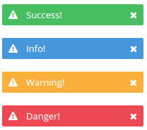

Alert
=====
Renders a notification message.



```jsx
<div>
    <Alert type="success">Success!</Alert>
    <Alert type="info">Info!</Alert>
    <Alert type="warning">Warning!</Alert>
    <Alert type="danger">Danger!</Alert>
</div>
```

### Props

**type={string}**  
The type of alert to display. One of "success", "info", "warning", or "danger".

**icon={string}**  
Name of the icon to display on the left hand side of the alert. Defaults to no icon.

**closeable={bool}**  
Whether the alert may be closed. Displays a close icon when true.

**closeTitle={string}**  
Displayed when hovering over the close icon.

### CSS
Adds `dp-alert` to the root element.

Adds `dp-alert--${type}` to the root element, where `${type}` matches the `type` prop value.
