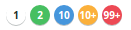

Badges/CircleBadge
==================
Circle shaped badge designed to display small numbers.



```jsx
<div>
    <CircleBadge>1</CircleBadge>
    <CircleBadge type="success">2</CircleBadge>
    <CircleBadge type="info">10</CircleBadge>
    <CircleBadge type="warning" max={10}>100</CircleBadge>
    <CircleBadge type="danger" max={99}>1000</CircleBadge>
</div>
```

### Props

**type={string}**  
The type of alert to display. One of "default", "success", "info", "warning", or "danger".

**max={number}**  
Truncate numbers higher than this value. For example when set to 99, the number 100 gets truncated to '99+'.

### CSS
Adds `dp-circle-badge` to the root element.

Adds `dp-badge--${type}` to the root element, where `${type}` matches the `type` prop value.

Adds `dp-bg--${type}` to the root element, where `${type}` matches the `type` prop value.
