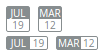

Badges/DateBadge
================
Displays the month and day in badge or pill format.



```jsx
<div>
    <DateBadge date={new Date()} />
    <DateBadge month="Mar" day="12" />

    <DateBadge date={new Date()} pill />
    <DateBadge month="Mar" day="12" pill />
</div>
```

### Props

**date={Date}**  
Date to display using a Date instance.

**month={string}**  
Month to display. Ignored when the `date` prop is set.

**day={string|number}**  
Day to display. Ignored when the `date` prop is set.

### CSS
Adds `dp-date-badge` to the root element.

Adds `dp-date-badge--pill` to the root element when displayed in pill form.
