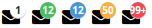

Badges/IconBadge
==================
Icon which displays a CircleBadge on top of it.



```jsx
<div>
    <IconBadge icon="envelope">
        1
    </IconBadge>
    <IconBadge icon="envelope" type="success">
        12
    </IconBadge>
    <IconBadge icon={<Icon name="envelope" size="large" />} type="info">
        12
    </IconBadge>
    <IconBadge icon="envelope" type="warning" iconSize="large">
        50
    </IconBadge>
    <IconBadge icon={<Icon name="envelope" size="large" />} type="danger" max={99}>
        100
    </IconBadge>
</div>
```

### Props

**icon={string}**  
Name of the icon from the [Font Awesome icon list](http://fontawesome.io/icons/).

**iconSize={string}**  
Displays the icon at the given size. Possible values are: 'xsmall', 'small', 'medium', 'large', and 'xlarge'.

**type={string}**  
The type of alert to display. One of "default", "success", "info", "warning", or "danger".

**max={number}**  
Truncate numbers higher than this value. For example when set to 99, the number 100 gets truncated to '99+'.

### CSS
Adds `dp-icon-badge` to the root element.
