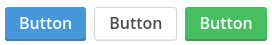

Buttons/Button
==============
Standard button.



```jsx
<div>
    <Button type="primary">Button</Button>
    <Button type="secondary">Button</Button>
    <Button type="cta">Button</Button>
</div>
```

### Props

**disabled={bool}**  
Whether or not the button is disabled or not.

### CSS
Adds `dp-button` to the root element.

### Examples

```jsx
import React from 'react';
import ReactDOM from 'react-dom';
import { Button } from 'Components/Buttons';
import Icon from 'Components/Icon';

const App = () => (
    <div>
        <Button size="l">Button</Button>
        <Button size="m">
            <Icon name="bug" />
            Button with icon
        </Button>
    </div>
);

ReactDOM.render(<App />, document.getElementById('mount'));
```