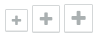
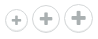

Buttons/Button
==============
Standard button.


```jsx
<div>
    <Button type="primary" size="large">Button</Button>
    <Button type="secondary" size="large">Button</Button>
    <Button type="cta" size="large">Button</Button>
</div>
```


```jsx
<div>
    <Button type="primary" size="large">
        <Icon name="bug" />
        Button
    </Button>
    <Button type="secondary" size="large">
        <Icon name="bug" />
        Button
    </Button>
    <Button type="cta" size="large">
        <Icon name="bug" />
        Button
    </Button>
</div>
```



```jsx
<div>
    <Button shape="square" type="secondary" size="small">
        <Icon name="plus" />
    </Button>&nbsp;
    <Button shape="square" type="secondary" size="medium">
        <Icon name="plus" />
    </Button>&nbsp;
    <Button shape="square" type="secondary" size="large">
        <Icon name="plus" />
    </Button>
</div>
```



```jsx
<div>
    <Button shape="round" type="secondary" size="small">
        <Icon name="plus" />
    </Button>&nbsp;
    <Button shape="round" type="secondary" size="medium">
        <Icon name="plus" />
    </Button>&nbsp;
    <Button shape="round" type="secondary" size="large">
        <Icon name="plus" />
    </Button>
</div>
```

### Props

**size={string}**  
One of "large", "medium", or "small".

**type={string}**  
Controls the color of the button. One of "primary", "secondary", or "cta".

**shape={string}**  
Controls the shape of the button. One of "default", "square", or "round".

**disabled={bool}**  
Whether or not the button is disabled or not.

### CSS
Adds `dp-button` to the root element.

Adds `dp-button--${type}` where `${type}` is the value of the `type` prop.

### Examples

```jsx
import React from 'react';
import ReactDOM from 'react-dom';
import { Button } from 'Components/Buttons';
import Icon from 'Components/Icon';

const App = () => (
    <div>
        <Button size="large">Button</Button>
        <Button size="medium">
            <Icon name="bug" />
            Button with icon
        </Button>
    </div>
);

ReactDOM.render(<App />, document.getElementById('mount'));
```