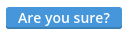

Buttons/ConfirmButton
=====================
Button with click confirmation.



```jsx
<div>
    <ConfirmButton message="Are you sure?">Delete</ConfirmButton>
</div>
```

### Props

**message={string}**  
The confirmation message.

**disabled={bool}**  
Whether or not the button is disabled or not.

### CSS
Adds `dp-button` to the root element.

### Examples

```jsx
import React from 'react';
import ReactDOM from 'react-dom';
import { ConfirmButton } from 'Components/Buttons';

const App = () => (
    <div>
        <ConfirmButton message="Are you sure?">Delete</ConfirmButton>
    </div>
);

ReactDOM.render(<App />, document.getElementById('mount'));
```