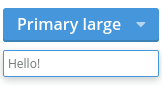

Buttons/DropdownButton
======================
Renders a button with a drop down icon and popper.



```jsx
<DropdownButton type="primary" size="large">
    Primary large
    <ButtonPopper>
        Hello!
    </ButtonPopper>
</DropdownButton>
```

### Props

**size={string}**  
One of "large", "medium", or "small".

**type={string}**  
One of "primary", "secondary", or "cta".

**disabled={bool}**  
Whether or not the button is disabled or not.

**onClick={func}**  
Called when the button is clicked.

### CSS
Adds `dp-dropdown-button` to the root element.

### Examples

```jsx
import React from 'react';
import { render } from 'react-dom';
import { DropdownButton, ButtonPopper } from 'Components/Buttons';

const App = () => (
    <div>
        <DropdownButton type="primary" size="large">
            Click Me
            <ButtonPopper>
                I am popper.
            </ButtonPopper>
        </DropdownButton>
    </div>
);

render(<App />, document.getElementById('mount'));
```
