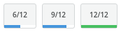

Buttons/ProgressButton
======================
Renders a button which contains a progress bar.



```jsx
<div>
    <ProgressButton percent={50} size="large">
        6/12
    </ProgressButton>
    <ProgressButton percent={75} size="large">
        9/12
    </ProgressButton>
    <ProgressButton percent={100} size="large">
        12/12
    </ProgressButton>
</div>
```

### Props

**percent={number}**  
The percentage complete.

**size={string}**  
One of "small", "medium", or "large".


### CSS
Adds `dp-progress-button` to the root element.
