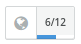

Buttons/TranslateButton
=======================
Renders a progress button along with globe icon.



```jsx
<TranslateButton percent={50} size="large">
    6/12
</TranslateButton>
```

### Props

**percent={number}**  
The percentage complete.

**size={string}**  
One of "small", "medium", or "large".


### CSS
Adds `dp-translate-button` to the root element.
