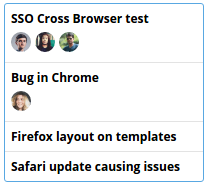

Cards/Card
==========
Renders a standard card.



```jsx
<Card>
    <List>
        <ListElement>
            <strong>
                SSO Cross Browser test
            </strong>
            <div>
                <Avatar src="/avatar1.png" />
                <Avatar src="/avatar2.png" />
                <Avatar src="/avatar3.png" />
            </div>
        </ListElement>
        <ListElement>
            <strong>
                Bug in Chrome
            </strong>
            <div>
                <Avatar src="/avatar4.png" />
            </div>
        </ListElement>
        <ListElement>
            <strong>
                Firefox layout on templates
            </strong>
        </ListElement>
        <ListElement>
            <strong>
                Safari update causing issues
            </strong>
        </ListElement>
    </List>
</Card>
```

### CSS
Adds `dp-card` to the root element.
