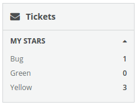
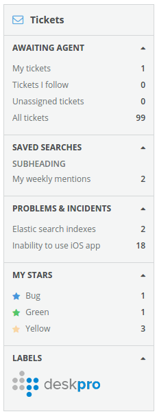

Columns/Column
==============
A navigation column containing expandable drawers. Semantically the column is an unordered list `<ul>` containing one or more list items `<li>`. Where each list item represents a "drawer" which may be opened or closed.



```jsx
<Column>
  <Heading>
    <Icon name="envelope"/>
    Tickets
  </Heading>
  <DrawerList>
    <Drawer>
      <Heading>
        My Stars
      </Heading>
      <ItemList>
        <Item count={1}>
          Bug
        </Item>
        <Item count={0}>
          Green
        </Item>
        <Item count={3}>
          Yellow
        </Item>
      </ItemList>
    </Drawer>
  </DrawerList>
</Column>
```

### Props

**role={bool}**  
The aria role.

### CSS
Adds `dp-column` class to the column container.

### Examples

```jsx
import React from 'react';
import { render } from 'react-dom';
import {
  Column,
  Heading,
  DrawerList,
  Drawer,
  ItemList,
  Item
} from 'Components/Columns';

const styles = {
  iconEnvelope: {
    color: '#59a8e2'
  },
  iconBlue: {
    color: '#4696DC'
  },
  iconGreen: {
    color: '#54c66a'
  },
  iconYellow: {
    color: '#f9d6a4'
  }
};

class App extends React.Component {

  render() {
    return (
      <Column className="dp-column__first">
        <Heading>
          <Icon name="envelope-o" style={styles.iconEnvelope} />
          Tickets
        </Heading>
        <DrawerList>
          {this.renderDrawerAgents()}
          {this.renderDrawerSearches()}
          {this.renderDrawerProblems()}
          {this.renderDrawerStars()}
          {this.renderDrawerLabels()}
        </DrawerList>
      </Column>
    )
  }

  renderDrawerAgents() {
    return (
      <Drawer>
        <Heading>
          Awaiting Agent
        </Heading>
        <ItemList>
          <Item count={1}>
            My tickets
          </Item>
          <Item count={0}>
            Tickets I follow
          </Item>
          <Item count={0}>
            Unassigned tickets
          </Item>
          <Item count={99}>
            All tickets
          </Item>
        </ItemList>
      </Drawer>
    )
  }

  renderDrawerSearches() {
    return (
      <Drawer>
        <Heading>
          Saved Searches
        </Heading>
        <Subheading>
          Subheading
        </Subheading>
        <ItemList>
          <Item count={2}>
            My weekly mentions
          </Item>
        </ItemList>
      </Drawer>
    )
  }

  renderDrawerProblems() {
    return (
      <Drawer opened={false}>
        <Heading count={2}>
          Problems &amp; Incidents
        </Heading>
        <ItemList>
          <Item count={2}>
            Elastic search indexes
          </Item>
          <Item count={18}>
            Inability to use iOS app
          </Item>
        </ItemList>
      </Drawer>
    )
  }

  renderDrawerStars() {
    return (
      <Drawer opened={false}>
        <Heading>
          My Stars
        </Heading>
        <ItemList>
          <Item count={1}>
            <Icon name="star" style={styles.iconBlue} />
            Bug
          </Item>
          <Item count={1}>
            <Icon name="star" style={styles.iconGreen} />
            Green
          </Item>
          <Item count={3}>
            <Icon name="star" style={styles.iconYellow} />
            Yellow
          </Item>
        </ItemList>
      </Drawer>
    )
  }

  renderDrawerLabels() {
    return (
      <Drawer opened={false}>
        <Heading>
          Labels
        </Heading>
        <ItemList>
          <Item>
            
          </Item>
        </ItemList>
      </Drawer>
    )
  }
}

render(<App />, document.getElementById('mount'));
```

