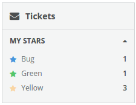

Columns/Item
==================
Standard drawer item which may display and number.

```jsx
<ItemList>
  <Item count={1}>
    Bug
  </Item>
  <Item count={1}>
    Green
  </Item>
  <Item count={3}>
    Yellow
  </Item>
</ItemList>
```

### Props

**count={number}**  
Number value to display inside the item.

**selected={bool}**  
Indicates whether the item is selected.

**onClick={func}**  
Called when the item is clicked.

**onSelect={func}**  
Called when the item is selected.

### CSS
Adds the `dp-column-item` class to the element.

Adds the `dp-drawer-item--selected` class to the element when it's in a "selected" state.

### Examples

```jsx
import React from 'react';
import { render } from 'react-dom';
import {
  Column,
  Heading,
  DrawerList,
  Drawer,
  ItemList,
  Item
} from 'Components/Columns';

const styles = {
  iconBlue: {
    color: '#4696DC'
  },
  iconGreen: {
    color: '#54c66a'
  },
  iconYellow: {
    color: '#f9d6a4'
  }
};

const App = () => (
  <Column>
    <Heading>
      <Icon name="envelope"/>
      Tickets
    </Heading>
    <DrawerList>
      <Drawer>
        <Heading>
          My Stars
        </Heading>
        <ItemList>
          <Item count={1}>
            <Icon name="star" style={styles.iconBlue} />
            Bug
          </Item>
          <Item count={1}>
            <Icon name="star" style={styles.iconGreen} />
            Green
          </Item>
          <Item count={3}>
            <Icon name="star" style={styles.iconYellow} />
            Yellow
          </Item>
        </ItemList>
      </Drawer>
    </DrawerList>
  </Column>
);

render(<App />, document.getElementById('mount');
```


