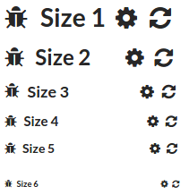

Common/Heading
==============
A header element which can be displayed with an icon and count number.



```jsx
<div>
    <Heading>Heading</Heading>
    <Heading size={2}>Heading</Heading>
    <Heading icon="bug">Heading</Heading>
    <Heading icon="bug" count={22}>Heading</Heading>
</div>
```

### Props

**size={number}**  
A value from 1 to 6 indicating the type of header to use, e.g. h1, h2, h3, etc.

**icon={string|element}**  
Icon to display to the left of the text. Either the name of an icon, or an `Icon` component.

**count={number}**  
Number value to display to the right of the text.

### CSS
Adds the `dp-heading` class to the created element.

Wraps the count value in the `dp-heading__count` class.
