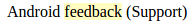

Common/Highlighter
==================
Highlights a word or phrase.



```jsx
<Highlighter highlight="feedback">
    Android feedback (Support)
</Highlighter>
```

### Props

**highlight={string}**  
The word or phrase to highlight in the children.

**element={string}**  
The HTML element used to wrap the highlighted phrase. Uses the "i" italics tag by default.

### CSS
Wraps the highlight phrase with the `dp-highlighted` class.
