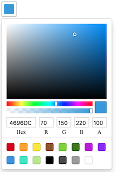

Forms/Colorpicker
=================
Renders an input with drop down color picker



```jsx
<Colorpicker
    onChange={(color) => {
        console.log(color)
    }}
/>
```

### Props

**value={object|string}}**  
The current value as an object `{r: 70, g: 150, b: 200, a: 1}` or a hexadecimal color

**format={string}**  
Input and output format, either `hex`, `rgb` or `hsl` 

**onChange={function}**  
Called when a color is chosen. Receives an object with the chosen color or a string with the hexadecimal value.

### CSS
Adds `dp-colorpicker` to the root element.