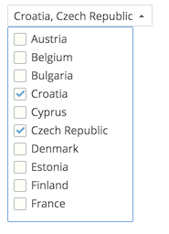

Forms/CustomSelect
==================
Renders a component looking like a select button where content is completely customizable.



```jsx
<div>
  <CustomSelect
    inputRenderer={this.inputRenderer}
    disabled={boolean('Disabled', false)}
    displayInputWhenOpened={boolean('Display input when opened', false)}
  >
    <List style={{maxHeight: 200, overflowY: 'scroll'}}>
      {multiOptions.map(option => (
        <ListElement
          key={option.value}
        >
          <Checkbox
            checked={options.indexOf(option.value) !== -1}
            value={option.value}
            onChange={this.onChange}
          >{option.label}</Checkbox>
        </ListElement>
      ))}
    </List>
  </CustomSelect>
</div>
```

### Props

**inputRenderer={function}**  
Function / Class to render input element.

**disabled={boolean}**  
Disable the element.

**displayInputWhenOpened={boolean}**  
Hide / Show the input when the menu is opened.
