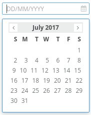

Forms/Datepicker
================
Renders an input with drop down date picker.



```jsx
<Datepicker
    onSelect={(date) => {
        console.log(date.toString());
    }}
/>
```

### Props

**placeholder={string}}**  
Text to display in the input field until a value is chosen.

**date={Date}**  
The initial date to display. Defaults to now.

**days={array}**  
Days of the week, e.g. 'Sun', 'Mon', 'Tue', etc. Defaults to the English spelling.

**months={array}**  
Months of the year, e.g. 'January', 'February', etc. Defaults to the English spelling.

### CSS
Adds `dp-datepicker` to the root element.
