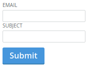

Forms/Form
==========
Renders a form and handles its submission.



```jsx
<Form onSubmit={(event, values) => { console.log(values); }}>
    <div>
        <Label>Email</Label>
        <Input name="email" label="Email" />
    </div>
    <div>
        <Label>Subject</Label>
        <Input name="subject" />
    </div>
    <div>
        <Button name="submit">
            Submit
        </Button>
    </div>
</Form>
```

### Props

**preventDefault={bool}**  
Automatically prevent the form from being submitted when set to true. When set to false the default can still be prevented inside the onSubmit callback.

**onSubmit={func}**  
Called when the form is submitted. Receives the event and form values object as arguments. Any child of the form with a "name" attribute will be treated as a form element, and its value added to the values object.


### CSS
Adds `dp-form` to the root element.
