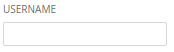

Forms/Group
===========
Groups a label and form children together.



```jsx
<Group label="Username" htmlFor="username">
    <Input id="username" />
</Group>
```

### Props

**label={string}}**  
Value for the group label.

**htmlFor={string}**  
ID of the child the label belongs to. When ommitted the component will try to discover the ID of the child input element.


### CSS
Adds `dp-form-group` to the root element.
