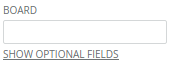

Forms/HiddenFields
==================
Wraps optional form fields which may be shown or hidden. Provides a clickable handle to show and hide the fields.



```jsx
<form>
    <div>
        <Label>BOARD</Label>
        <Input name="board" />
    </div>
    <HiddenFields opened={false}>
        <div>
            <Label>DESCRIPTION</Label>
            <Input name="description" />
        </div>
    </HiddenFields>
</form>
```

### Props

**opened={bool}**  
When true the children are displayed.

**labelShow={string}**  
Link text to display to show the children.

**labelHide={string}**  
Link text to display to hide the children.

**labelStyle={object}**  
Styles which get applied to the label.

**labelClassName={string}**  
Class name applied to the label.


### CSS
Adds `dp-hidden-fields` to the root element.

Adds `dp-hidden-fields__label` to the label.


### Examples

```jsx
import React from 'react';
import { render } from 'react-dom';
import Avatar from 'Components/Avatar';

const App = () => (
    <form>
        <div>
            <Label htmlFor="dp-input-board">BOARD</Label>
            <Input id="dp-input-board" />
        </div>
        <div>
            <Label htmlFor="dp-input-list">LIST</Label>
            <Input id="dp-input-list" />
        </div>
        <HiddenFields
            labelShow="Show optional fields"
            labelHide="Hide optional fields"
            opened={false}
        >
            <div>
                <Label htmlFor="dp-input-description">DESCRIPTION</Label>
                <Input id="dp-input-description" />
            </div>
            <div>
                <Label htmlFor="dp-input-due-date">DUE DATE</Label>
                <Input id="dp-input-due-date" />
            </div>
        </HiddenFields>
    </form>
);

render(<App />, document.getElementById('mount'));
```