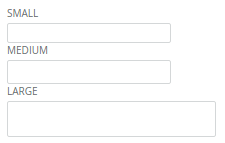

Forms/Input
===========
Standard form input element.



```jsx
<form>
    <Label>Small</Label>
    <Input className="dp-input--small" />
    <Label>Medium</Label>
    <Input className="dp-input--medium" />
    <Label>Large</Label>
    <Input className="dp-input--large" />
</form>
```

### Props

**invisible={bool}**  
Set to true to only display a border around the element when it's focused.

### CSS
Adds `dp-input` to the root element.
