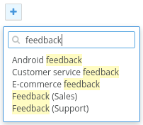

Forms/SearchButton
==================
Renders a button which opens a search form.



```jsx
<SearchButton
    placeholder="Search..."
    emptyPlaceholder="Type to search."
    value={this.state.value}
    onSelect={this.handleSelect}
    results={this.state.results}
>
    <p>No results found</p>
</SearchButton>
```

### Props

**results={array}**  
List of search results.

**emptyPlaceholder={string}**  
Displayed in the drop down before a value is entered.

**closeOnClickOutside={bool}**  
Close the search box when the user clicks outside of it.

**onSelect={function}**  
Called when a search result is clicked. Receives the result value and index as arguments.

See also `Forms/Input` for more props.


### CSS
Adds `dp-search-button` to the root element.


### Examples
This example uses the Javascript `fetch` API to grab a list of search terms matching the given input.

```jsx
import React from 'react';
import ReactDOM from 'react-dom';

/**
 * Displays a button which, when clicked, opens a search form. The search form uses
 * the fetch API to make ajax requests to a backend service which returns a list
 * of terms matching the given search term.
 */
class App extends React.Component {
  /**
   * Constructor
   *
   * @param {*} props
   */
  constructor(props) {
    super(props);
    this.state = {
      value:   '',
      results: []
    };
  }

  /**
   * Callback for the SearchButton.onSelect event
   *
   * The SearchButton.onSelect event is triggered when the user selects a value from
   * the search results. Either by clicking on the item or highlighting it and pressing
   * the ENTER key.
   *
   * @param {string} value Current input value
   */
  handleSelect = (value) => {
    console.log(value);
  };

  /**
   * Callback for the SearchButton.onChange event
   *
   * Triggered each time the input value changes, the method will fetch search results
   * matching the current value using the fetch API.
   *
   * @param {string} value Current input value
   */
  handleChange = (value) => {
    if (value.length === 0) {
      this.setState({ value, results: [] });
    } else {
      fetch('/results.json')
        .then(res => res.json())
        .then((results) => {
          this.setState({ value, results });
        });
    }
  };

  /**
   * Renders the search button
   *
   * @returns {XML}
   */
  render() {
    const { value, results } = this.state;

    return (
      <SearchButton
        placeholder="Search..."
        value={value}
        results={results}
        onChange={this.handleChange}
        onSelect={this.handleSelect}
      />
    );
  }
}

ReactDOM.render(<App />, document.getElementById('mount'));
```