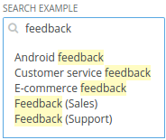

Forms/SearchInline
==================
Creates an inline search input.



```jsx
<div>
    <Label>SEARCH EXAMPLE</Label>
    <SearchInline
        placeholder="Search..."
        value={this.state.value}
        onChange={this.handleChange}
        results={this.state.results}
    />
</div>
```

### Props

**results={array}**  
List of search results.

**onSelect={function}**  
Called when a search result is clicked. Receives the result value and index as arguments.

See also `Forms/Input` for more props.

### CSS
Adds `dp-search-inline` to the root element.
