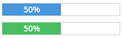

Progress
========
Renders a progress bar.



```jsx
<div>
    <Progress size="large" type="primary" style={{ border: '1px solid #ccc' }}>
        <ProgressBar percent={50}>50%</ProgressBar>
    </Progress>
    <Progress size="large" type="cta" style={{ border: '1px solid #ccc' }}>
        <ProgressBar percent={50}>50%</ProgressBar>
    </Progress>
</div>
```

### Props

#### Progress

**size={string}**  
One of "large", "medium", or "small".

**type={string}**  
One of "primary" or "cta".

#### ProgressBar

**percent={number}**  
A number between 0 and 100.


### CSS
Adds `dp-progress` to the root container.

Adds `dp-progress__bar` to the progress bar.
