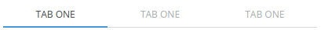

Tabs/Tabs
=========
Renders a group of links as tabs.



```jsx
<Tabs active="one">
    <TabLink name="one">
        Tab One
    </TabLink>
    <TabLink name="two">
        Tab One
    </TabLink>
    <TabLink name="three">
        Tab One
    </TabLink>
</Tabs>
```

### Props

**active={string}**  
The name of the active tab.

**onChange={func}**  
Called when the active tab changes.


### CSS
Adds `dp-tabs` to the root element.

### Examples

```jsx
import React from 'react';
import ReactDOM from 'react-dom';
import Pane from 'Components/Pane';
import { Tabs, TabLink } from 'Components/Tabs';

class App extends React.Component {
  constructor(props) {
    super(props);
    this.state = {
      activePane: 'one'
    };
  }

  render() {
    const { activePane } = this.state;

    return (
      <div>
        <Tabs active="one" onChange={(a) => { this.setState({ activePane: a }); }}>
          <TabLink name="one">
            Tab One
          </TabLink>
          <TabLink name="two">
            Tab One
          </TabLink>
          <TabLink name="three">
            Tab One
          </TabLink>
        </Tabs>
        <Pane hidden={activePane !== 'one'}>
          Tab one!
        </Pane>
        <Pane hidden={activePane !== 'two'}>
          Tab two!
        </Pane>
        <Pane hidden={activePane !== 'three'}>
          Tab three!
        </Pane>
      </div>
    );
  }
}

ReactDOM.render(<App />, document.getElementById('mount'));
```