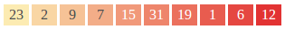

Urgency
=======
Renders a message in a box which is colored to match an urgency level between 1 and 10.



```jsx
<div>
    <Urgency level={1}>23</Urgency>
    <Urgency level={2}>2</Urgency>
    <Urgency level={3}>9</Urgency>
    <Urgency level={4}>7</Urgency>
    <Urgency level={5}>15</Urgency>
    <Urgency level={6}>31</Urgency>
    <Urgency level={7}>19</Urgency>
    <Urgency level={8}>1</Urgency>
    <Urgency level={9}>6</Urgency>
    <Urgency level={10}>12</Urgency>
</div>
```

### Props

**level={number}**  
A number between 1 and 10 representing the urgency level.


### CSS
Adds `dp-urgency` to the root element.
